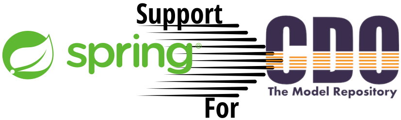

= Spring Data CDO



Version Compatability
|===
|*Spring Data CDO* | *Eclipse Modeling Tools* | *CDO Protocol*
// |1.0.0
// |2024-09 (4.33.0)
// |51

|0.7.3 (latest)
|https://www.eclipse.org/downloads/packages/release/2022-12/r/eclipse-modeling-tools[2022-12 (4.26.0)]
|48

|0.7.2
|https://www.eclipse.org/downloads/packages/release/2022-12/r/eclipse-modeling-tools[2022-12 (4.26.0)]
|48

|0.6.0-SNAPSHOT
|https://www.eclipse.org/downloads/packages/release/2022-12/r/eclipse-modeling-tools[2022-12 (4.26.0)]
|48
|===

The primary goal of the https://projects.spring.io/spring-data[Spring Data] project is to make it easier to build Spring-powered applications that use new data access technologies such as non-relational databases, map-reduce frameworks, and cloud based data services.

This module provides infrastructure components to build repository abstractions for stores dealing with the
https://www.eclipse.org/cdo/[*Connected Data Objects (CDO) model repository*] of Eclipse.

== Getting Started

The standard use case of this framework is to store and read native `CDOObject` and standard `EObject`.
To be clear, the framework does not perform a transformation of standard Java POJOs to their Ecore representatives.
Only Java objects of class type `CDOObject` or `EObject` (and in legacy mode) are supported.
Legacy mode: Models that are not converted for CDO support.
See also https://wiki.eclipse.org/CDO/Preparing_EMF_Models[Preparing EMF Models]

Your domain models should be defined using the Eclipse EMF Ecore metamodel as usual, or dynamically at runtime.
Eclipse EMF also supports the generation of an API from Ecore models.
They can also be used afterwards with *Spring Data CDO*.

=== Working with Eclipse IDEs

This framework includes functionality to launch a standalone CDO server.
Use the Eclipse CDO Explorer, which allows you to easily view and interact with Ecore models hosted on the CDO server.

* Download CDO Explorer via the link:https://www.eclipse.org/downloads/packages/installer[Eclipse Installer].
See table above to see which Eclipse Version to use.

=== Dependency Configuration (Maven)

Just add the following Maven dependency to your project's `pom.xml`:

[source,xml]
----
<dependency>
  <groupId>org.bigraphs.springframework.data</groupId>
  <artifactId>spring-data-cdo</artifactId>
  <version>0.7.3</version>
</dependency>
----

These dependencies are required when you want to start the standalone CDO server that is shipped with this framework:

[source,xml]
----
<dependency>
  <groupId>org.eclipse.platform</groupId>
  <artifactId>org.eclipse.core.runtime</artifactId>
  <version>3.26.100</version>
</dependency>
<dependency>
    <groupId>org.eclipse.platform</groupId>
    <artifactId>org.eclipse.equinox.common</artifactId>
    <version>3.17.100</version>
</dependency>
----

// ==== SNAPSHOT Releases
//
// For SNAPSHOT releases also include the following repository:
//
// [source,xml]
// ----
// <repositories>
//     <repository>
//         <snapshots>
//             <enabled>true</enabled>
//         </snapshots>
//         <id>ossrh</id>
//         <url>https://s01.oss.sonatype.org/content/repositories/snapshots</url>
//     </repository>
// </repositories>
// ----


=== Usage Examples

The following examples show some possible configuration and usage scenarios.

==== Domain classes

The framework can handle native EMF models:

[source,java]
----
// any auto-generated object of an EMF model or native CDO model
interface Person extends EObject {}

interface Person extends CDOObject {}
----

Non-native EMF domain classes (i.e., classes that don't extend `EObject` or the `CDOObject` interface) should be annotated in the following way to provide necessary details:

[source,java]
----
@CDO(path = "your/repository/resource/path",    // CDO resource path
        nsUri = "http://www.example.org/personDomainModel", // namespace of the Ecore model
        ePackage = PersonDomainModelPackage.class,  // the EPackage of the model
        ePackageBaseClass = "org.example.ecore.personDomainModel.PersonDomainModelPackage"
)
class PersonWrapper {
    // ID is mandatory
    @Id
    CDOID id;

    // Provide here the actual EObject model that the framework can access
    // because PersonWrapper does not extend EObject
    @EObjectModel(classFor=Person.class)
    public Person model; // Person extends from EMF's EObject class
}
----

They effectively work like a wrapper for internal members, which are of class `EObject` or `CDOObject`.
Additionally, an ID must be specified of type `CDOID` using the `@Id` annotation feature of Spring.

==== Spring Configuration

Enable the Spring repository support for CDO repositories:

[source,java]
----
// Spring Configuration Class
@Configuration
@EnableCdoRepositories(basePackageClasses = PersonRepository.class)
//@EnableCdoRepositories(basePackages = "org.example.repository") // Java package to repository interfaces
public class CDOServerConfig {
    // ...
}
----

==== Repository Definition

[source,java]
----
package org.example.repository;

@Repository
public interface PersonRepository extends CdoRepository<PersonWrapper, CDOID> {
    // ...
}
----

==== Ecore Package Initialization: Local and Remote

With regard to EMF-related programming, the respective `EPackage` must be registered in the global package registry first (see https://download.eclipse.org/modeling/emf/emf/javadoc/2.9.0/[EPackage.Registry]).
The registry provides a mapping from namespace URIs to `EPackage` instances.

> Though, this framework has some internal mechanism to initialize the EPackage in the registry automatically, it may not always find it.

We advise to initialize the corresponding `EPackage` that is going to be used with this framework by using standard mechanisms of EMF:

[source,java]
----
    @BeforeClass
    public static void beforeClass() throws Exception {
        PersonDomainModelPackageImpl.init();
        // Or: EPackage.Registry.INSTANCE.put("http://www.example.org/personDomainModel", PersonDomainModelPackage.eINSTANCE);

        // This statement should not fail:
        EPackage ePackage = EPackage.Registry.INSTANCE.getEPackage("http://www.example.org/personDomainModel");
        Assert.notNull(ePackage, "Model Package couldn't be found in the EPackage Registry.");
    }
----

Especially when working with CDO the package should be registered locally and remotely:

[source,java]
----
CdoTemplate template = new CdoTemplate(factory);
CDOPackageRegistry.INSTANCE.put(BookstoreDomainModelPackage.eNS_URI, BookstoreDomainModelPackage.eINSTANCE);
CDOPackageRegistry remoteRegistry = template.getCDOPackageRegistry(); //acquire the remote CDO package registry
EPackage ePackage = remoteRegistry.getEPackage(BookstoreDomainModelPackage.eNS_URI);
if (ePackage == null) {
    remoteRegistry.put(BookstoreDomainModelPackage.eNS_URI, BookstoreDomainModelPackage.eINSTANCE);
}
----

=== Events

When required, one can listen to specific events emitted by some repository actions for adding extended behavior.
Events are implemented for Delete, Save and Insert operations, including "after" and "before" notions for fine-grained control.

=== Standalone CDO Server

For testing purposes you can start a standalone CDO server like this:

[source,java]
----
CDOStandaloneServer server = new CDOStandaloneServer("repo1");
CDOStandaloneServer.start(server);
----
== Development: Building from Source

You do not need to build from source to use Spring Data for CDO.
The dependencies are deployed to the https://repo.spring.io[Central Repository].

But if you want to try out the latest and greatest, Spring Data for CDO can be easily built with the regular `mvn` command,
or by using the https://github.com/apache/maven-wrapper[maven wrapper].
If you want to build with the regular `mvn` command, you will need https://maven.apache.org/download.cgi[Maven v3.8.3 or above].

You also need JDK 17.
Check that the `JAVA_HOME` environment variable is pointing to the correct JDK, or use:

[source,shell]
----
# (1) Select Java 17
$ sudo update-alternatives --config java

# (2) Check
$ mvn --version
----

To build Spring Data for CDO, execute the following commands in the terminal from the root of this project:

[source,shell]
----
# (1) Get all required Eclipse dependencies first. This step needs to be run only once:
$ mvn clean validate -f ./spring-data-cdo-distribution/pom.xml -PfetchEclipseDependencies

# (2) Package and install the 'spring-data-cdo' module containing the framework
$ mvn install -DskipTests
----

The dependencies are deployed to your local Maven repository usually located at `~/.m2/`.

=== Building the Reference Documentation

Building the documentation builds also the project without running tests:

[source,bash]
----
$ mvn install -DskipTests -Pdistribute
----

The generated documentation is available from `target/site/reference/html/index.html`.
The Maven profile `distribute` is provided by `spring-data-parent`.
For more information see link:https://github.com/spring-projects/spring-data-build[https://github.com/spring-projects/spring-data-build] on how to set up the Asciidoc documentation.

=== Deploy

**Release Deployment**

The Java artifacts are deployed to the Central Repository:

[source,shell]
----
# Deploy single modules
$ mvn clean deploy -DskipTests -P release,central -pl :spring-data-cdo
$ mvn clean deploy -DskipTests -P release,central -pl :spring-data-cdo-distribution

# Deploy all modules
$ mvn clean deploy -DskipTests -P release,central
----

The staged artifacts have to be released manually.

**Snapshot Deployment**

Execute the following goals to deploy a SNAPSHOT release of this framework to the snapshot repository:

```shell
# Use the default settings.xml located at ~/.m2/
mvn deploy -P ossrh -DskipTests -pl :spring-data-cdo
mvn deploy -P ossrh -DskipTests -pl :spring-data-cdo-distribution
```

Note: When `SNAPSHOT` prefix is present in the version name, a Snapshot Deployment is performed.
Otherwise, a Release Deployment is performed and the artifacts must be released manually after review (see [here](https://central.sonatype.org/publish/release/)).

**Settings**

The Maven GPG plugin is used to sign the components for the deployment.
It relies on the gpg command being installed:
```shell
sudo apt install gnupg2
```

and the GPG credentials being available e.g. from `settings.xml` (see [here](https://central.sonatype.org/publish/publish-maven/)).
In `settings.xml` should be a profile and server configuration both with the `<id>central</id>`.

More information can be found [here](https://central.sonatype.org/publish/requirements/gpg/).

Listing keys: `gpg --list-keys --keyid-format short`

The `pom.xml` must also conform to the minimal requirements containing all relevant tags as required by Sonatype.


== Code of Conduct

This project is governed by the link:CODE_OF_CONDUCT.adoc[Spring Code of Conduct].
By participating, you are expected to uphold this code of conduct.
Please report unacceptable behavior to dominik.grzelak@tu-dresden.de.

== License

This library is Open Source software released under the Apache 2.0 license.

```text
   Copyright 2023-present Dominik Grzelak

   Licensed under the Apache License, Version 2.0 (the "License");
   you may not use this file except in compliance with the License.
   You may obtain a copy of the License at

 http://www.apache.org/licenses/LICENSE-2.0

   Unless required by applicable law or agreed to in writing, software
   distributed under the License is distributed on an "AS IS" BASIS,
   WITHOUT WARRANTIES OR CONDITIONS OF ANY KIND, either express or implied.
   See the License for the specific language governing permissions and
   limitations under the License.
```
